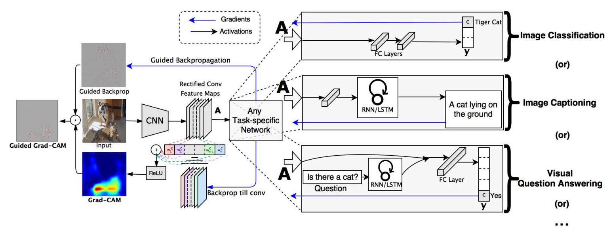

# Grad-CAM: Visual Explanations from Deep Networks via Gradient-based Localization

[[`Paper`](https://arxiv.org/abs/1610.02391)]

## Algorithm Explained
Grad-CAM (Gradient-weighted Class Activation Mapping) is a technique used in the field of computer vision and deep learning to understand the reasoning behind the decisions made by convolutional neural networks (CNNs) in visual tasks. It does so by producing a coarse localization map highlighting the important regions in the image for predicting the concept of interest (see figure below).

The algorithm is based on the idea that the importance of a feature map can be computed by the gradient of the score for a given concept (e.g. class) with respect to the feature map.

The algorithm can be divided into the following steps:
1. **Forward Pass**: Run the input image through the CNN to obtain the raw model predictions. This forward pass goes all the way to the output layer to get the class scores before the softmax layer.

2. **Target Class Selection**: Choose the class you want to visualize. This could be the predicted class or any other class of interest.

3. **Compute Gradients**: Perform a backward pass with respect to the selected target class, usually by setting the gradient of the target class score to 1 and the gradient of all other class scores to 0. This backward pass is not performed for the entire model but typically up to a certain convolutional layer of interest. This is because the earlier layers capture more generic features (like edges, textures), while the latter layers capture more specific features relevant to class predictions.

4. **Pooling Gradients**: Compute the global average of the gradients for each unit in the chosen convolutional layer. This step results in a small set of numbers (one for each feature map of the chosen layer), which are indicative of the importance of each feature map with respect to the target class.

5. **Weight Feature Maps**: Multiply each feature map in the chosen convolutional layer by the corresponding weights computed from the gradients. This operation highlights the important regions for the target class.

6. **Create Heatmap**: Sum all the weighted feature maps along the channel dimension and apply a ReLU (Rectified Linear Unit) to the result. The ReLU is applied to only consider features that have a positive influence on the class of interest (i.e., pixels whose intensity should be increased in order to increase the target class score).

7. **Upsample Heatmap**: The resulting heatmap is of the same size as the output of the chosen convolutional layer, which is smaller than the input image. Therefore, the heatmap is upsampled back to the input image size. This can be done using interpolation techniques.

8. **Overlay Heatmap**: Finally, the heatmap is overlaid on the original input image to show the most influential regions for the classification decision. The heatmap is often made semi-transparent and superimposed on the original image so that one can see the image and the highlighted areas simultaneously.

GradCAM thus allows you to visualize which parts of an image are considered important by the CNN for a particular classification decision. This can be crucial for interpreting the model's predictions, especially in applications where understanding the model's reasoning is important, such as in medical imaging or autonomous driving.

## Ressources
[[`Grad-CAM: Visual Explanations from Deep Networks via Gradient-based Localization`](https://arxiv.org/abs/1610.02391)]

[[`Pytorch Implementation`](https://github.com/jacobgil/pytorch-grad-cam)]

[[`Anomaly Detection Dataset`](https://zenodo.org/records/8086136)]